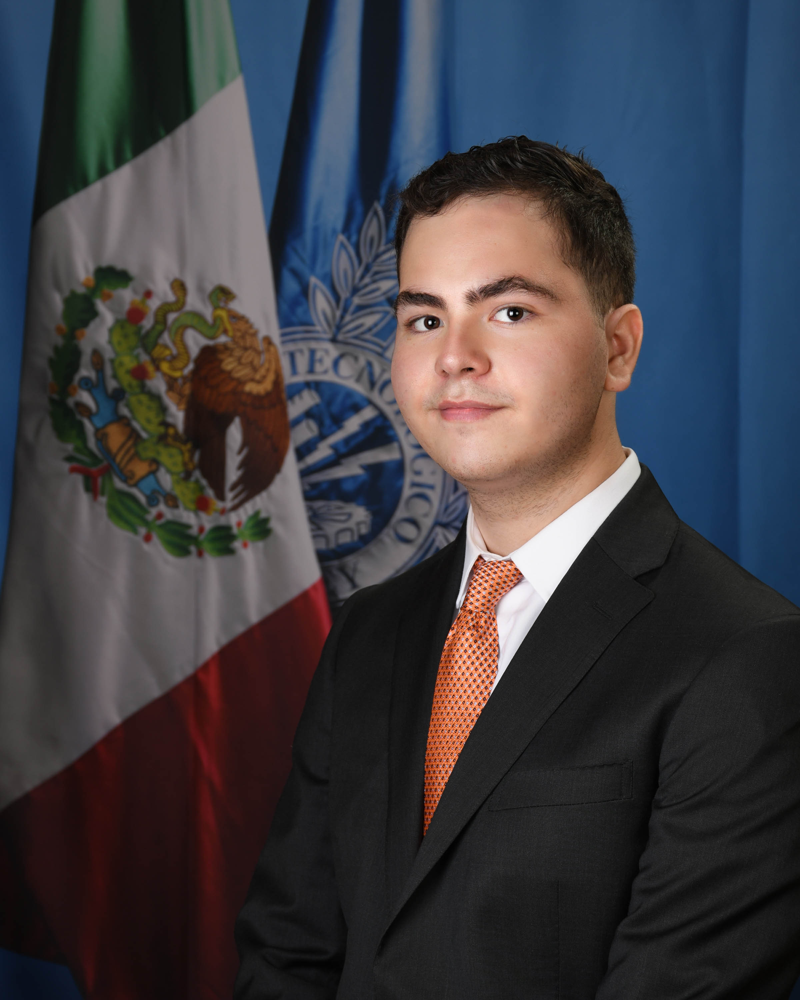
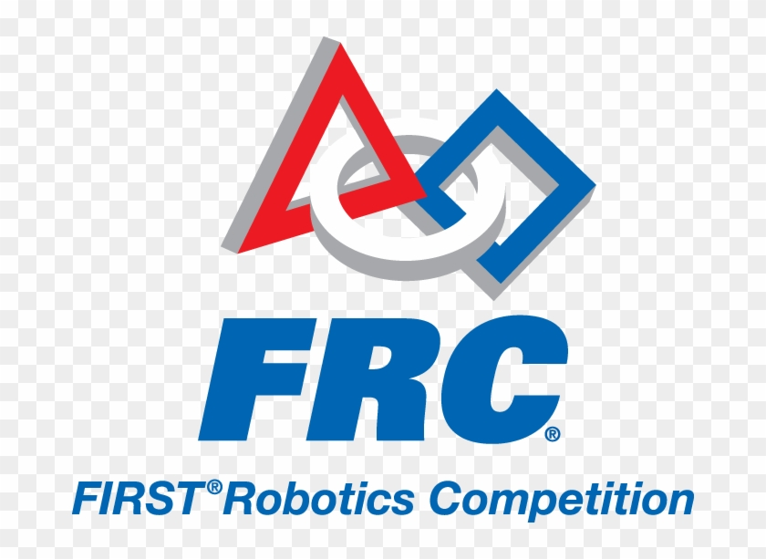

  
  <h1>Francisco Zavala</h1>
  
<strong>Undergraduate Biomedical Engineering Student | Robotics & Software Developer</strong>

---

## 👋 About Me

Undergraduate **Biomedical Engineering** student at **Universidad Iberoamericana Puebla (IBERO Puebla)** with a strong background in **competitive robotics**, **software development**, and **technology-driven projects**.  

I have participated in national and international robotics competitions since high school and currently develop **mobile and web applications** using modern frameworks and programming languages. I am highly adaptable, detail-oriented, and interested in **innovative, flexible, and remote-first opportunities**, including internships and freelance roles.

- 🎓 Expected Graduation: **2028**
- 🌍 Languages: **Spanish (Native)** | **English (Full Professional)**
- 💡 Interests: Robotics, Mobile Apps, AI-supported systems, Emerging Technologies

---

## 🎓 Education

### Universidad Iberoamericana Puebla (IBERO Puebla)
**Bachelor's Degree in Biomedical Engineering**  
*2024 – 2028 (Expected)*

---

### Instituto Tecnológico y de Estudios Superiores de Monterrey (ITESM) – Campus Puebla  
**High School Education**  

During my high school years, I actively participated in robotics competitions and multidisciplinary engineering projects, developing both technical and teamwork skills.

---

## 🤖 Robotics Competitions & Technical Activities

### FIRST Robotics Competition (FRC)  
**Imperator Team – ITESM Campus Puebla**

- Participated in the **FIRST Robotics Competition (FRC)** as part of the Imperator team  
- Worked on engineering design, problem-solving, and team-based technical challenges  
- Gained experience in real-world robotics development under competitive conditions  

---

### Guerra de Robots – IEEE IPN (Mexico)

- Competitor in the **Drone Racing** category  
- Applied electronics, control systems, and rapid decision-making in high-pressure environments  
- Collaborated with multidisciplinary teams from different institutions  

---

## 💻 Technical Projects

### 📱 Event Organizer & Ticket Sales App  
**Framework:** Flutter  
**Description:**  
A mobile application designed to create, organize, sell, and manage events. Includes event creation, user interaction, and administrative features. Focused on scalability and user-friendly design.

---

### 💬 WhatsApp Message Reminder & Sender App  
**Language:** Kotlin  
**Description:**  
An Android application that allows users to schedule reminders and automate message sending. Emphasizes permission handling, background tasks, and system integration.

---

### 🌐 Web & Software Development Projects
- Python-based automation and analysis scripts  
- C++ projects for academic and competitive use  
- Java-based web development projects  

🔗 **GitHub Portfolio:**  
👉 *[Add your GitHub link here](https://github.com/patxi2004)*

---

## 🛠 Technical Skills

### Programming Languages
- **Python**
- **C++**
- **Kotlin**
- **Dart (Flutter)**
- **Java**

### Frameworks & Tools
- Flutter
- Android Development
- Git & GitHub
- Basic Web Development

### Other Skills
- Analytical Thinking
- Technical Documentation
- Problem Solving
- Team Collaboration
- Remote & Independent Work

---

## 🌍 Languages

- **Spanish:** Native  
- **English:** Full Professional Proficiency  

---

## 📌 Interests & Goals

I am currently seeking **internship, freelance, and entry-level opportunities** where I can apply my analytical skills, technical background, and creativity. I am especially interested in roles related to **technology evaluation, software development, AI-supported platforms, and digital analysis**.

---

📫 **Contact**  
- Email: *eguski71@gmail.com*  
- LinkedIn: *www.linkedin.com/in/francisco-zavala-27048b296*
